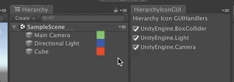

# HierarchyIconGUI
Unity Customizable Hierarchy Icon GUI

## Feature
* Draw Custom Icon GUI in Hierarchy

## Usage
1. Import HierarchyIconGUI Folder into your unity project.
2. Create your provide GUIHandler class. and override function CreateGUIHandler. (e.x. CustomGUIHandlerProvider.cs)
3. Open HierarchyIconGUI Window (MenuItem("Window/HierarchyIconGUI"))

## Licence

[MIT](LICENSE)

## Author

[Syy9](https://github.com/Syy9)
